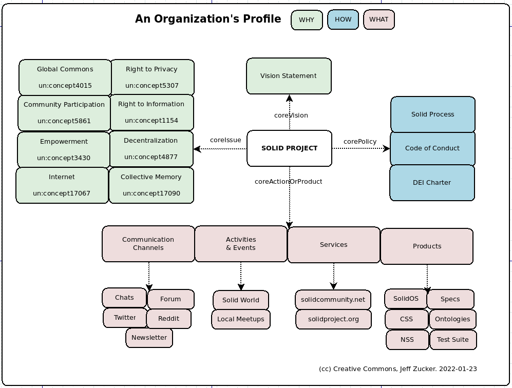
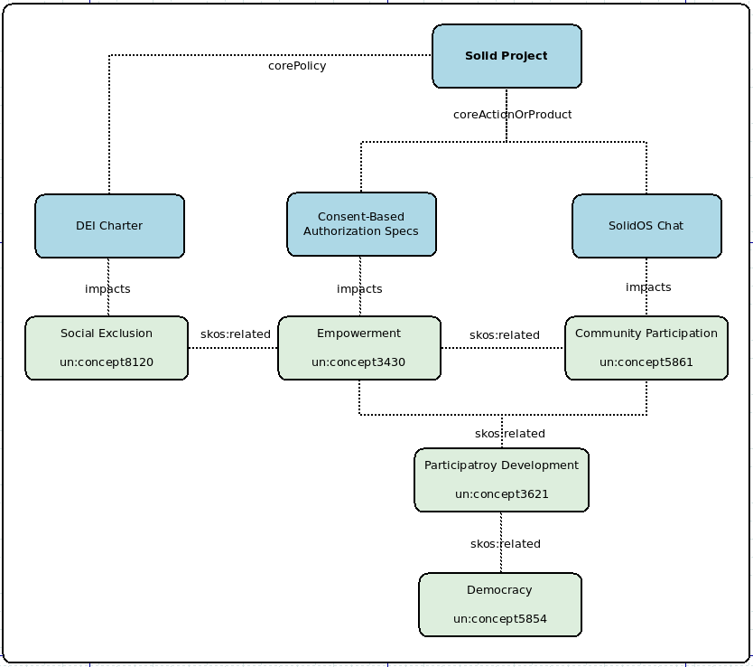

# Modeling the Social Benefit of Organizations

One of the foundational visions of Solid and the web itself is that "The web should be a platform that helps people and provides a net positive social benefit."[[1](https://www.w3.org/2001/tag/doc/ethical-web-principles/)] Following are some thoughts on how to begin using linked data to model social benefit and in particular, how to model the social benefit of organizations.  

Tim BL, in [his post on Public Data](https://solidos.solidcommunity.net/public/2021/BuildingSolidAppsUsingPublicData-V3.html) spoke of several parts of an organizatin's profile, focusing primarily on the type of organization and on the membership.  I will expand on that to talk about how an organization can model its goals and activities through a lens of social benefit.

Social benefit relates to social issues - problems that people and communities face, rights and needs they have. A robust vocabulary exists for discussing social issues - [the UNESCO thesaurus](http://vocabularies.unesco.org/thesaurus) (hereafter referred to as un:).  It is a large, carefully organized, multi-lingual list of human activities that includes many kinds of social issues - problems like `un:concept5051` ("Domestic Violence"), human rights like `un:concept7681` ("Right to Food"), and other social needs such as `un:concept1983` ("Youth Hostels").  Additionally, the thesaurus uses the skos vocabulary to define broader/narrower/related relationships between issues, is available as [Turtle](http://vocabularies.unesco.org/exports/thesaurus/latest/unesco-thesaurus.ttl) and [RDF-XML](http://vocabularies.unesco.org/browser/rest/v1/thesaurus/data?format=application/rdf%2Bxml
), and has a [SPARQL endpoint](https://skos.um.es/sparql/).

The broader/narrower relationships in the UNESCO thesaurus make it a good candidate for things like drop-down menus although it will undoubetdly need to be supplemented with other definitions of social issues to meet the needs of specific organizations.

As a start I propose a class "Issue" and four predicates that take it as range.

* **:Issue** - A human right, need, problem, or other social issue.

* **:impacts** - The relationship between a product, service, or activity and a social issue it has an impact on.

* **:coreIssue** - The relationship between an organization and an issue it aims to address.

* **:coreActionOrProduct** - The relationship between an organization and the actions it takes or products it offers that impact its core issues.

* **:corePolicy** - The relationship between an organization and documents which state the organization's policy on a social issue.

We can then make statements like these :

* `<#Greenpeace> :coreIssue <#WaterPollution>, <#ClimateChange>.`

* `<#EU> :coreActionOrProduct [a schema:Action; label "GDPR Penalty"; :impacts <#RightToPrivacy>].`

* `<#CompanyXYZ> :corePolicy [a schema:CreativeWork; label "Diversity Policy"; :impacts <#RacialPrejudice>].`

I see two related ways organizations can make use of these kinds of statements - 1) on a broad level as a way to present the organization's profile and 2) At a more specific level to label the issues impacted by each specific product, service, and activity as a record of the "why" part of "how/why" and as part of the process of evaluating the organization's impact on the world.

For an organization's profile, we could offer dropdowns similar to the workplace-picker for individuals that would allow them to specify their relationship to the issues.  This would provide a very concise overview of the organization.  For example, part of Solid Project's profile might be modeled something like this :

If we provide a UI to display details about the actions/products, this could be the basis of a public-facing profile for the organization.  Visitors would be able to see not only that an organization aims to address an issue, but also what services and produsts they offer in relation to the issue.  To paraphrase Bishop Romero  - a food bank that feeds the poor and an organization asking why the poor are starving are both dealing with the issue of right to food, but only one of them is taking actions immediately relevant to a hungry person.  So the "kind" of organization is quite relevant but it can not be captured in a sinle type such as "NGO" or "Enterprise", or even by core issues - it must be defined also by what activities the organization undertakes and the products and services it offers.

In addition to this broad public-facing use of the proposed terms, the organization's internal information infrastructure can also benefit from the terms.  For example stating that a given software product impacts a specific issue supports both internal review of impacts and external grant reporting.  Tim BL created a [diagram of how and why](https://www.w3.org/DesignIssues/diagrams/solid/solid-how-why.svg) that draws some broad connections between Solid and goals such as "Democracy".  Here is an example of how some of those connections might be modeled in a more detailed way :

Although my examples apply mostly to NGOs, governmental agencies, and enterprises with explicitly social goals, there is no reason these same terms can't be used with more general organizations.  A car manufacturer has "Transportaion" as a core issue.  The UNESCO Thesaurus contains terms for most industries, fields of academic study, and other concepts that can form the core issues of organizations.

There is also a potential for comparative use of the terms.  For example to search for all organizatins offering certain kinds of services in relation to a given issue.  A regulatory organization might keep lists of organizations which carry out activities that impact a given issue and therefore fall under its regulations.  

The car manufacturer might list "Transportation" as one of its core issues while the Environmental Protection Agency might list "Climate Change" as an issue the car manufacturer's products impact.  Net social benefit would have to take both into account.

## Author
Jeff Zucker

## Creation Date
2022-01-23
